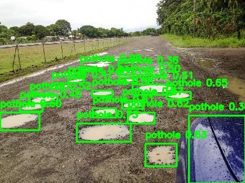

# Pothole Detection Using YOLOv8x and Perspective Transformation

[](https://github.com/ADVAYA1/Pothole-Detection)

**Live Repository:** [https://github.com/ADVAYA1/Pothole-Detection](https://github.com/ADVAYA1/Pothole-Detection)

## Project Overview 📖

This project presents a robust, vision-based system for detecting potholes on road surfaces. Leveraging the state-of-the-art **YOLOv8x** object detection model, this work introduces a novel image processing pipeline featuring **perspective transformation** to significantly enhance detection accuracy. By remapping road images to a "bird's-eye" view, the system improves the identification of small and distant potholes, a critical task for ensuring vehicle safety and advancing autonomous navigation systems.

This project was developed by **Ajay Deep Rawat**, **Tejas Pakhale**, and **Rahul Gupta**.

---

## Methodology 💡

The core of this project is a sophisticated workflow designed to maximize detection accuracy through a series of image processing and deep learning stages.

### 1. Data Preprocessing
Raw images are cleaned and prepared to ensure they are suitable for the model training pipeline.

### 2. Perspective Transformation (Key Innovation)
A perspective transformation is applied to each image, shifting the viewpoint to a top-down ("bird's-eye") perspective. This innovative step prioritizes the road surface, making distant and smaller potholes appear larger and more distinct, which is crucial for improving detection rates.

### 3. Bounding Box Adjustment
Following the perspective shift, the bounding box annotations for each pothole are automatically recalculated and adjusted to accurately frame the transformed objects.

### 4. Data Augmentation
To build a more robust model and prevent overfitting, various data augmentation techniques are applied, including rotations, scaling, and flipping. This process artificially expands the diversity of the training dataset.

### 5. Model Training and Inference
The **YOLOv8x model** is trained on the enhanced and augmented dataset. The trained model is then used to perform inference on unseen test images, identifying and localizing potholes with high precision.

---

## Results 🏆

The system successfully detects potholes under various road conditions. The model outputs the original image with detected potholes highlighted by **green bounding boxes**. Each box includes the label "pothole" and a **confidence score** indicating the model's certainty.

As detailed in the research paper, this method achieves significant gains in **mean Average Precision (mAP)** and other precision-recall metrics when compared to more conventional detection approaches.

### Sample Output


*An example of a detected pothole with its bounding box and confidence score.*

---

## Usage 🚀

The complete implementation of this project can be found in the `FinalPotholeDetection77.ipynb` Jupyter Notebook. To run the project, follow these steps:

1.  **Clone the repository:**
    ```bash
    git clone [https://github.com/ADVAYA1/Pothole-Detection.git](https://github.com/ADVAYA1/Pothole-Detection.git)
    cd Pothole-Detection
    ```
2.  **Set up your environment:** Ensure you have a Python environment with Jupyter Notebook and the required dependencies installed. It is recommended to use Google Colab for GPU support.
3.  **Mount Google Drive:** The notebook is designed to work with Google Colab. The first cell mounts your Google Drive to access the dataset and save the results.
4.  **Run the Notebook:** Execute the cells in `FinalPotholeDetection77.ipynb` sequentially to perform data loading, preprocessing, model training, and inference.

---

## Dependencies 📦

The following major libraries are required to run the project:

* **PyTorch**
* **Ultralytics (for YOLOv8)**
* **OpenCV-Python**
* **NumPy**
* **Matplotlib**

You can install the primary dependency for YOLOv8 using pip:
```bash
pip install ultralytics
